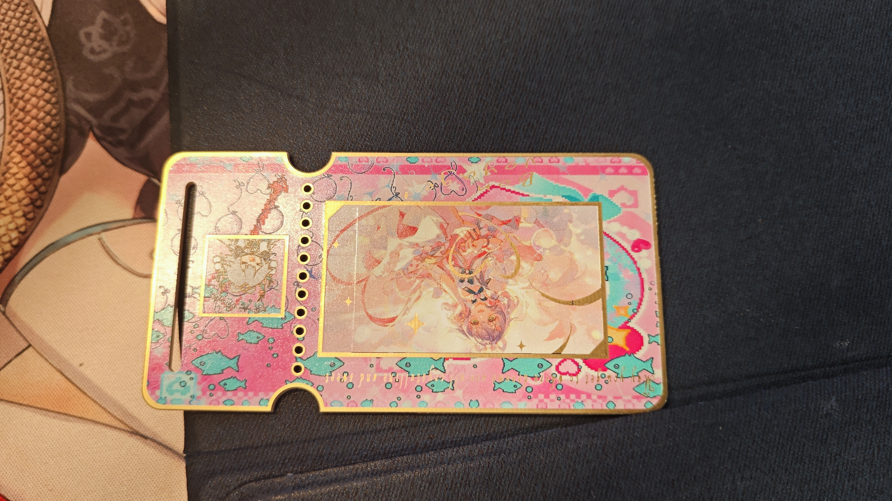
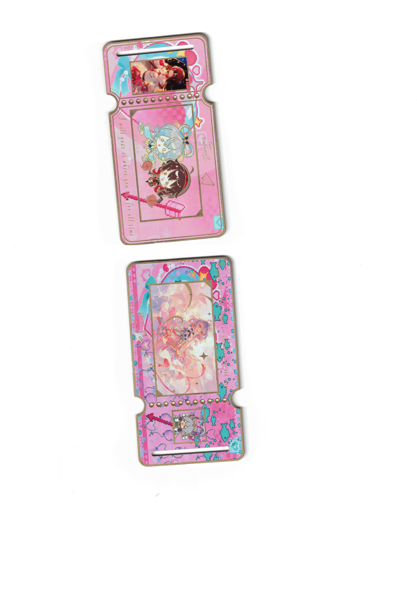

# Luo-Tianyi-PCB

 

洛天依南北组主题沉金艺术纪念PCB票卡，嘉立创开源硬件，无电气功能纯收藏卡

## Star History

## 📖 项目简介

这是一套仿照演出票根样式设计的收藏级 PCB 卡片，以洛天依、乐正绫（南北组）为主题，采用嘉立创 PCB 工艺实现。

- 金色边框、画框描边、角色小框轮廓全部使用**沉金工艺**，金属亮金色还原票券烫金效果。
- 背景采用彩色阻焊 + 丝印像素风图案，实现粉色主题底纹、小鱼、爱心、气球、像素装饰元素。
- 英文花体文案、Q 版表情包、角色原画窗口全部通过 PCB 丝印实现。
- 外形做了票根专属缺口、定位圆孔排、侧边开槽，高度还原实体撕拉票券的形态。
- 共 2 张卡片：
  1. 卡片 A：洛天依主视觉大图 + 龙耳 Q 版小表情包副图
  2. 卡片 B：南北组 Q 版双人主图 + 乐正绫角色小图

> 
> 设计思路：把虚拟偶像的纪念票做成电路板实体，用 PCB 沉金替代传统纸质烫金，耐存放、不褪色，适合收藏。

## 🎨 PCB 工艺说明（嘉立创下单关键参数）

> 
> ⚠️ 本板无线路，纯艺术 PCB，**不要打钢网、不要做贴片**。
## 🛠️ 使用方法

### 1. 本地编辑修改

1. 使用 **嘉立创 EDA 专业版 (JLCEDA)** 打开 `.PcbDoc` 工程文件。
2. 你可以自由替换：中间角色画面、右下角 Q 版表情包、修改文案、修改像素背景图案。
3. 修改金色边框：金色 = 顶层阻焊层开窗，不要去改丝印层；想要哪里金色，就在顶层阻焊画出开窗区域。
4. 彩色背景：修改顶层阻焊颜色与图案。
5. 文字、插画、像素元素放在顶层丝印层。
6. 修改完成后输出 Gerber 文件。

> 
> 重要提醒：
> 
> 
> - ❌ 不要把金色线条画在丝印层，丝印没有金色。
> - ✅ 金色部分：顶层走线画轮廓，**顶层阻焊层开窗**，生产沉金之后就会呈现金属金色。

### 2. 嘉立创下单打板步骤

1. 上传项目导出的 Gerber 压缩包到嘉立创打板页面。
2. 板厚务必选择 `0.8mm`。
3. 表面工艺：选择 **沉金**。
4. 阻焊颜色：选择**彩色阻焊，粉色**。
5. 确认层数 2 层，不需要钢网，不需要贴片。
6. 确认外形：预览外形，确认票根缺口、圆孔、侧边开槽完整。
7. 提交订单。

> 
> ⚠️ 彩色阻焊为嘉立创高阶工艺，价格高于普通绿油板；如果只是测试，可以临时改为红色阻焊做测试版看轮廓效果。

### 3. 到手之后使用

1. 卡片为 PCB 实体卡片，锋利边缘注意不要划伤手。
2. 可放入银行卡卡套、收藏卡套保存。
3. 禁止弯折 PCB 板，FR-4 板材弯折会断裂。
4. 沉金表面尽量避免大力摩擦，防止金层磨损。
5. 适合摆拍、收藏、手作展示。

## 📜 开源协议

本项目采用 **CC BY-NC-SA 4.0**（署名—非商业性使用—相同方式共享 4.0 国际）协议。

- ✅ 允许：个人玩家免费下载、学习、修改、自行打样制作、无偿分享；
- ❌ 禁止：未经书面许可用于任何商业用途——包括销售成品/套件、收费代工或代打样、商业广告、付费课程或内容、众筹、批量生产售卖；
- ℹ️ 衍生作品需沿用相同开源协议，并注明原作者与原仓库地址；
- 📄 完整法律文本见仓库根目录 `LICENSE` 文件。

> 角色形象版权归原作品方所有；本开源仅针对 PCB 工程文件与 Gerber 文件本身，不构成对角色形象的授权。
